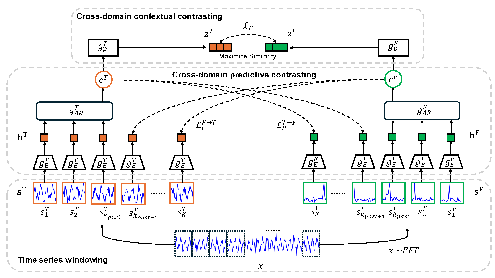

# Time Series Representation Learning Via Cross-Domain Predictive and Contextual Contrasting: Application to Fault Detection

This repository is the official implementation of [PAPER](https://papers.ssrn.com/sol3/papers.cfm?abstract_id=5085741). 

_by: Ibrahim Yousef, Sirish L. Shah, and R. Bhushan Gopaluni_

## Overview

<p align="center">

</p>


Data-driven methods for fault detection increasingly rely on large historical datasets, yet annotations are costly and time-consuming. As a result, learning approaches that minimize the need for extensive labeling, such as self-supervised learning (SSL), are becoming more popular. Contrastive learning, a subset of SSL, has shown promise in fields like computer vision and natural language processing, yet its application in fault detection is not fully explored. In this paper, we propose **Cross-Domain Predictive and Contextual Contrasting (CDPCC)**, a novel contrastive learning framework designed to extract informative latent representations from time series data. CDPCC is specifically designed to capture the cross-domain dynamics between time and frequency features of time series signals. The framework first splits the time series into non-overlapping frames, applying FFT to each frame to create its spectral view. The *cross-domain predictive contrasting module* then learns correlations and dynamic patterns between the time and frequency domains. In addition, we propose a *cross-domain contextual contrasting module* to capture discriminative features. We evaluate CDPCC on fault detection tasks using both simulated and industrial benchmark datasets. Experimental results demonstrate that a linear classifier trained on the features learned by CDPCC performs comparably to fully supervised models. Moreover, CDPCC proves highly efficient in few-labelled and transfer learning scenarios—achieving superior performance with only 50\% of labelled data compared to fully supervised training on the entire labelled dataset.


## Requirements

To install requirements:

```setup
pip install -r requirements.txt
```

CDPCC has been implemented using Python = 3.11

## Datasets

We consider three publicly available benchmark datasets: 

- [CSTH](https://zenodo.org/records/10093059) (datasets are available in /datasets/CSTH)
- [Arc Loss](https://www.sciencedirect.com/science/article/pii/S0959152423001105) (dataset can be downloaded from [Dataverse](https://doi.org/10.5683/SP3/NREPZM))


>📋  Describe how to train the models, with example commands on how to train the models in your paper, including the full training procedure and appropriate hyperparameters.

## Evaluation

To evaluate my model on ImageNet, run:

```eval
python eval.py --model-file mymodel.pth --benchmark imagenet
```

>📋  Describe how to evaluate the trained models on benchmarks reported in the paper, give commands that produce the results (section below).

## Pre-trained Models

You can download pretrained models here:

- [My awesome model](https://drive.google.com/mymodel.pth) trained on ImageNet using parameters x,y,z. 

>📋  Give a link to where/how the pretrained models can be downloaded and how they were trained (if applicable).  Alternatively you can have an additional column in your results table with a link to the models.

## Results

Our model achieves the following performance on :

### [Image Classification on ImageNet](https://paperswithcode.com/sota/image-classification-on-imagenet)

| Model name         | Top 1 Accuracy  | Top 5 Accuracy |
| ------------------ |---------------- | -------------- |
| My awesome model   |     85%         |      95%       |

>📋  Include a table of results from your paper, and link back to the leaderboard for clarity and context. If your main result is a figure, include that figure and link to the command or notebook to reproduce it. 


## Contributing

>📋  Pick a licence and describe how to contribute to your code repository. 
